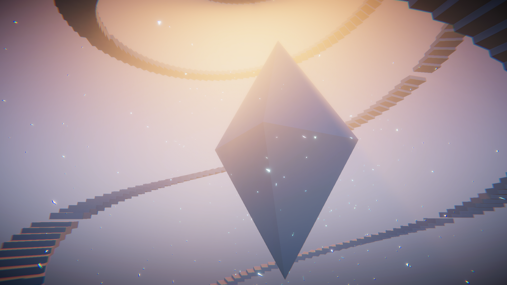
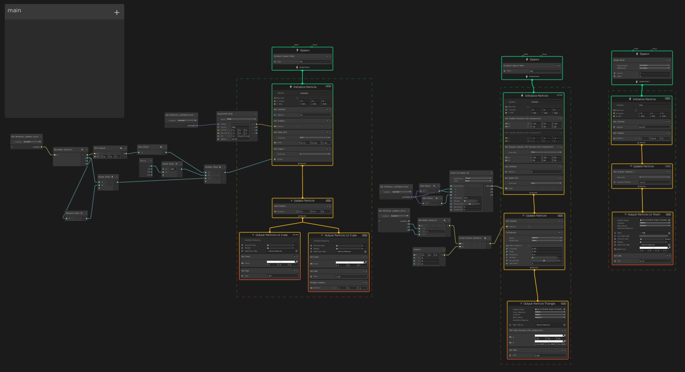

# heaven

## About

[Shader1weekCompo](https://www.shader1weekcompo.org/)の第4回に合わせて作ったVFX作品。  
UnityのMeshコンポーネントなどは使わずに、すべてVFXGrpahで処理している。

## (Tested) Environment

|env|value|
|:--:|:--:|
|OS|Windows 10 home|
|Unity|2019.4.12|
|HDRP|7.3.1|
|VFX Graph|7.3.1|
|GPU|GeForce GTX 1060|
|CPU|Intel Core-i7 7700|

## Installation & Usage

上のUnityバージョンで、`Assets/Scenes/Sample Scene`を開きます。

## Appendix

...

## Contact

何かございましたら[にー兄さんのTwitter](http://twitter.com/ninisan_drumath)まで。
